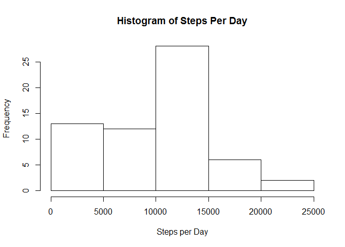
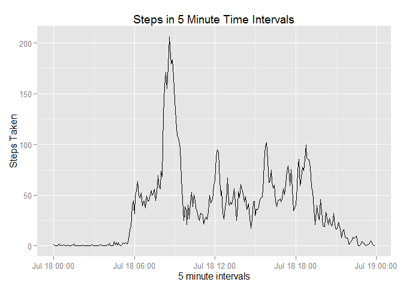
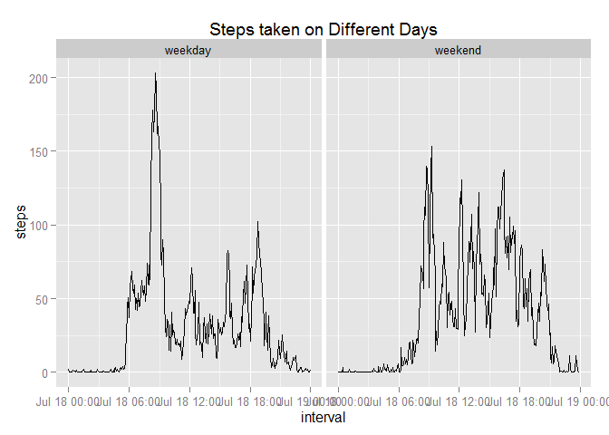

# Reproducible Research: Peer Assessment 1
Jacob Townson  
July 14th, 2015  


## Loading and preprocessing the data

This code unzips the file given to us in the assignment, then reads it into a data frame.In order to prove the set up here works, I have printed out the head of the data frame activity.


```r
unzip("./activity.zip")
activity <- read.csv("./activity.csv")
head(activity)
```

```
##   steps       date interval
## 1    NA 2012-10-01        0
## 2    NA 2012-10-01        5
## 3    NA 2012-10-01       10
## 4    NA 2012-10-01       15
## 5    NA 2012-10-01       20
## 6    NA 2012-10-01       25
```


## What is mean total number of steps taken per day?

The first line of code here makes a new data frame using the plyr package. This new data frame sums up the number of steps per day. 


```r
activeday <- ddply(activity,.(date),summarize,steps=sum(steps, na.rm = TRUE))
```

This next line makes a simple histogram (displayed below) of the number of steps per day. 


```r
hist(activeday$steps, main = "Histogram of Steps Per Day", 
     xlab = "Steps per Day")
```

 

Using the mosaic package, I found the interesting facts about this data, including the mean and median as displayed below.


```r
favstats(activeday$steps)
```

```
##  min   Q1 median    Q3   max    mean       sd  n missing
##    0 6778  10395 12811 21194 9354.23 5405.895 61       0
```

## What is the average daily activity pattern?

First we must change the interval values in the activity data frame to be actual time values. The code below can do this for us (presented by the head function).


```r
activity$interval <- sprintf("%04d", activity$interval)
activity$interval <- format(strptime(activity$interval, format="%H%M"), 
                            format = "%H:%M")
head(activity)
```

```
##   steps       date interval
## 1    NA 2012-10-01    00:00
## 2    NA 2012-10-01    00:05
## 3    NA 2012-10-01    00:10
## 4    NA 2012-10-01    00:15
## 5    NA 2012-10-01    00:20
## 6    NA 2012-10-01    00:25
```

Now that we have these values labeled as times, we can make a new data frame with the mean at each of these time intervals. 


```r
activetime <- ddply(activity,.(interval),summarize,steps=mean(steps, na.rm = TRUE))
activetime$steps <- as.numeric(activetime$steps)
activetime$interval <- as.POSIXct(activetime$interval,format="%H:%M")
```

Finally, we can make a clean plot using this method.


```r
qplot(x = activetime$interval, y = activetime$steps, geom = 'line',
     main = "Steps in 5 Minute Time Intervals", xlab = "5 minute intervals", 
     ylab = "Steps Taken")
```

 

```r
activetime <- activetime[rev(order(activetime$steps)),]
head(activetime)
```

```
##                interval    steps
## 104 2015-07-18 08:35:00 206.1698
## 105 2015-07-18 08:40:00 195.9245
## 107 2015-07-18 08:50:00 183.3962
## 106 2015-07-18 08:45:00 179.5660
## 103 2015-07-18 08:30:00 177.3019
## 101 2015-07-18 08:20:00 171.1509
```

This code also shows us that the max amount of average steps is 206.1698 steps. By doing a little searching by putting the columns in order, we find that this happens at the time interval from 8:35 and 8:40 AM.

## Inputing missing values

Using this simple line of code, we can find all of the missing values in the entire activity data frame.


```r
sapply(activity, function(x) sum(is.na(x)))
```

```
##    steps     date interval 
##     2304        0        0
```

The strategy I chose for filling in the missing data values was to just put $0$ in as the value. It is not sophisticated, but it represents the "worst case scenario" by showing what it would be like if the person did not walk at all during these times. This does put a strange twist on the data, but given the circumstances, I find it hard to make any other assumptions about the data in this set. 


```r
activity_miss <- activity
activity[is.na(activity)] <- 0
```

**Note the data frame activity_miss was made in order to keep record of what values were actually missing and which were $0$**


```r
activeday.new <- ddply(activity,.(date),summarize,steps=sum(steps))
hist(activeday.new$steps, main = "Histogram of Steps Per Day", 
     xlab = "Steps per Day")
```

 

```r
favstats(activeday.new$steps)
```

```
##  min   Q1 median    Q3   max    mean       sd  n missing
##    0 6778  10395 12811 21194 9354.23 5405.895 61       0
```

This code presents us with our new data and it's properties with the missing values filled in with $0$. As we can see, it is actually the exact same as when we left the missing values in, however, this way there is data in the set to use. 

## Are there differences in activity patterns between weekdays and weekends?

First, we must add the appropriate format for dates in R, then continue by adding in the factor variable for weekdays and weekends.


```r
activity$date <- strptime(as.character(activity$date), "%Y-%m-%d")
day <- weekdays(activity$date)
for(i in 1:(length(day))){
  if((day[i] == "Saturday") | (day[i] == "Sunday")){
    day[i] <- "weekend"
  }
  else{
    day[i] <- "weekday"
  }
}
activity <- cbind(activity, day)
activity$day <- as.factor(activity$day)
```

Next we must organize the data so that we can graph it in two different panels with the correct data. Using this code, we will make the plot and set it into the value $p$.


```r
temp <- subset(activity, select = c(interval, day, steps))
activewk <- temp %>% group_by(interval,day) %>%
summarise_each(funs(mean))
activewk$interval <- as.POSIXct(activewk$interval,format="%H:%M")
p <- qplot(interval, steps, data = activewk, geom = c("line"),
           main = "Steps taken on Different Days", facets = .~day)
p
```

 

It would seem as though with the data created in this method, we get that weekday steps are higher earlier, and similar later in the day, It also seems to be that people are up and moving more on the weekends later at night. 

